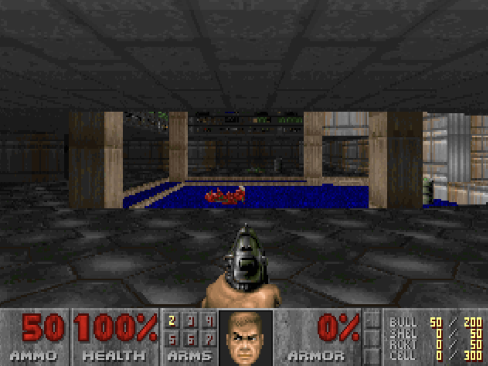

# OG DOOM

The OG, **DOOM** just like it was in 1993. Big chunky pixels. Sound Blaster tunes. No modern stuff.



You'll need some `WAD` files to play. You can buy DOOM on GoG or Steam and grab the WAD files
from there, or download the free Shareware DOOM Episode 1 from archive.org: [doom.ZIP](https://archive.org/download/DoomsharewareEpisode/doom.ZIP)

This is a port of the [linuxdoom-1.10](https://github.com/id-Software/DOOM) source release.<br>
It uses [Nuked-OPL3](https://github.com/nukeykt/Nuked-OPL3) for Adlib/Sound Blaster emulation.<br>
It uses [LittleMUS](https://github.com/raffecat/LittleMUS) to play the original DOOM music.<br>
It uses [SDL2](https://github.com/libsdl-org/SDL/tree/SDL2) as a porting layer (kind of.)

OK there's a tiny bit of modern stuff. It uses WASD controls, and mouselook. It works on modern systems.

## Releases

There are no binary releases yet, but you can build from source for now.

## Building

The project uses submodules. Check out with:

```sh
git clone --recurse-submodules https://github.com/raffecat/OG-DOOM.git
```

Use this command to update (or add missing) submodules:

```sh
git submodule update --init --recursive
```

### Building on Linux

Assuming you have something like `apt`:

```sh
apt install build-essential sdl2 clang
make
```

It builds with `clang`. it might build with `gcc`.

### Building on Mac OS

Building requires Apple's XCode Developer Tools; the `xcode-select`
command installs what you need. You may need to open the XCode desktop
application and accept the License Agreement before the tools will work.

You'll also need [Homebrew](https://brew.sh/) to install SDL2 as shown below.
The linuxdoom Makefile assumes you're using `brew` but it's also possible to
download [SLD2](https://github.com/libsdl-org/SDL/releases/tag/release-2.30.11)
manually and modify the Makefile with your download location.

```sh
xcode-select --install       ; install clang (XCode)
brew install sdl2
make
```

### Building on Windows

Download an [SLD2 Release](https://github.com/libsdl-org/SDL/releases/tag/release-2.30.11).

You can build the project using VSCode or Microsoft Visual Studio.
Instructions to follow.

## Updating dependencies

To update submodule dependencies, if that becomes necessary, from the project root:

```sh
git submodule update --remote
```

## License

The DOOM source code has the following licese:

Copyright (c) ZeniMax Media Inc.<br>
Licensed under the GNU General Public License 2.0.

See the file LICENSE.TXT for the full license.
